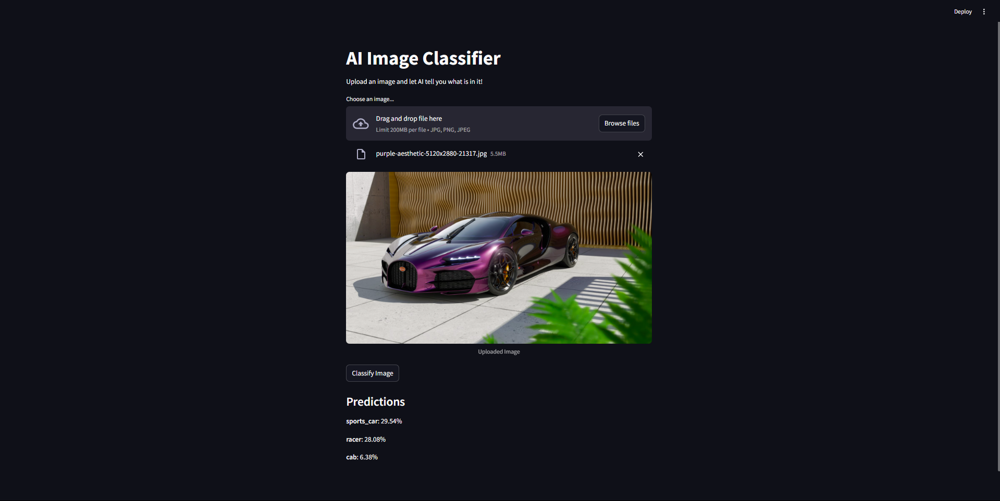

# 🖼️ AI Image Classifier

This project is a simple yet powerful **AI Image Classifier** built using **Streamlit**, **TensorFlow Keras**, and the **MobileNetV2** model pre-trained on the ImageNet dataset.

It allows users to upload an image, processes it using deep learning, and returns the top 3 predictions of what the image might be.

---

## 🚀 Demo



---

## 📸 Features

- 🧠 Uses **MobileNetV2**, a lightweight CNN model trained on ImageNet.
- 🖼️ Allows image uploads in `.jpg` and `.png` formats.
- 🔄 Preprocesses the image for optimal classification results.
- 📈 Displays the **top 3 predictions** with probability scores.
- 🌐 Built with **Streamlit** for interactive, web-based UI.

---

## 🛠️ Installation

1. Clone this repository:

```bash
git clone https://github.com/KunalxKushwaha/Image-Classifier.git
cd Image-Classifier
pip install -r requirements.txt
streamlit run app.py
```

## 📂 Project Structure


# Author- Kunal Kushwaha✒️
